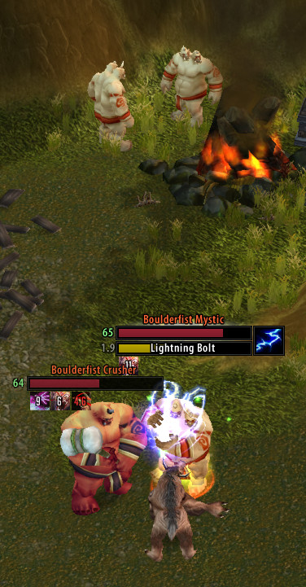
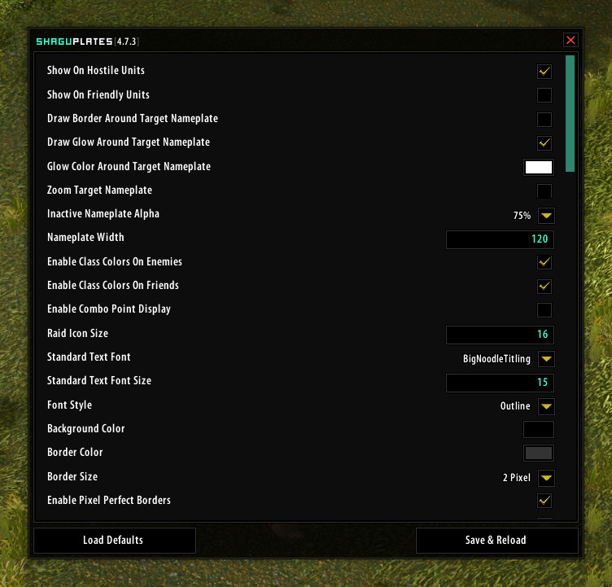
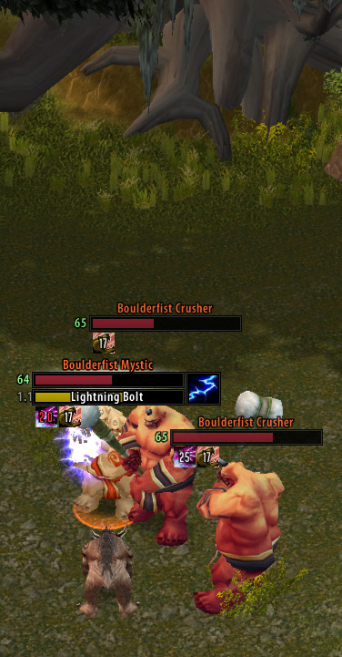

# ShaguPlates

A World of Warcraft: Vanilla and Burning Crusade addon, that is compatible to the original game versions 1.12.1 and 2.4.3 from back in the days. This addon modifies and extends the default nameplates by several features.

Initially, this project started as a fork of CustomNameplates that became an entire rewrite and was then rewritten from scratch several times. At one point, the ShaguPlates got merged into pfUI and received over time many updates there. Nowadays, this addon is a *mostly* auto generated stand-alone verion of the pfUI-nameplates to allow people without pfUI to still use its nameplates.

**Notice:**
*DO NOT use this addon in combination with [pfUI](https://github.com/shagu/pfUI). This or a superior version of it, is already included there. Also please do not send any pull requests to files that are part of the autogenerating process. Instead please prepare and send your update to the [pfUI](https://github.com/shagu/pfUI) project.*

**Features:**
* **Class Colors** on nameplates healthbar make it easy to notice all different classes around you.

* **Hidden Healthbars** on specific units like Totems, Critters and many others can be enabled to reduce the screen clutter.

* **Zoom & Glow Effects** on the current target can be enabled to easily detect whats important.

* **Health Values** on nameplates are detected based on the damage you deal and can be shown on the healthbar.

* **Debuffs & Durations** are shown below *each* nameplate if configured.
  (*For vanilla, all debuff-durations are based on a built-in database and may not always reflect the actual duration to 100%*)

* **Debuff Caches** can be activated on the nameplates, to make it remember the debuffs it had while it was the target. Those are also updated when you hover the nameplate with the mouse cursor.

* **Debuff Filters** help to only display those debuffs that are relevant for you.

* **Combo Points** can be enabled to show up on the nameplates.

* **Cast Bars** are displayed on each nameplate where a cast was detected. (*On TBC the native `GetCastingInfo` API is used, so only target casts are displayed. On Vanilla the casts are guessed based on the combat log and an internal database that includes the average durations for each spell. As the combat log only includes unit names, you might see the same cast on more units that share the same name.*)

* **A Lot of Options** help to customize the nameplates to perfectly fit your needs. Choose your own fonts, font sizes and font styles. Apply your own colors, borders and resize the plates to your favorite sizes...

* **Vanilla Only** options, such as non-blocking mouse look when right-clicking on nameplates and overlapping health bars can be enabled.

* **Elite and Rare** identifier are displayed as "+" and "R" (or "R+") on the nameplate as soon as a unit has been detected to be either one of those.

## Commands

* **/shaguplates** to access the options panel

## Installation (Vanilla)
1. Download **[Latest Version](https://github.com/shagu/ShaguPlates/archive/master.zip)**
2. Unpack the Zip file
3. Rename the folder "ShaguPlates-master" to "ShaguPlates"
4. Copy "ShaguPlates" into Wow-Directory\Interface\AddOns
5. Restart Wow

## Installation (The Burning Crusade)
1. Download **[Latest Version](https://github.com/shagu/ShaguPlates/archive/master.zip)**
2. Unpack the Zip file
3. Rename the folder "ShaguPlates-master" to "ShaguPlates-tbc"
4. Copy "ShaguPlates-tbc" into Wow-Directory\Interface\AddOns
5. Restart Wow
